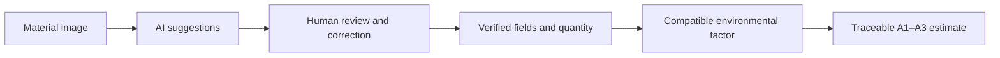

# ReUP — Explainable AI for Construction Material Reuse

### Turning material images into verified information and transparent environmental estimates.

Reusable construction materials can retain value long after their first use. Yet companies often lack the information needed to assess them in time: what the material is, which component it belongs to, what condition is visible, and how it compares environmentally with an equivalent new product.

This capstone develops an **explainable, human-in-the-loop AI framework for ReUP** to address that information gap. It connects computer vision with human verification and a transparent environmental calculation, helping users move from an uploaded image to a structured, traceable screening assessment.

## The problem

Material reuse decisions depend on trustworthy information. In practice, that information is often scattered across photographs, incomplete inventories, and inconsistent records. Identifying a potentially reusable component is only the first step; users also need a credible basis for understanding its environmental implications.

An image prediction alone cannot provide that basis. Models can mistake surface appearance for material identity, confuse components, or express confidence in an incorrect result. Environmental comparisons introduce further questions about quantities, units, factor sources, and lifecycle boundaries.

**The project addresses both challenges: extracting useful preliminary information and making the resulting assessment understandable and open to review.**

## The solution

The framework gives AI, people, and environmental data distinct roles in one workflow:

1. **Upload a material image.** Three trained vision models suggest material type, component type, and visible condition.
2. **Review the evidence.** Confidence scores, ranked alternatives, and abstention help communicate uncertainty. Grad-CAM visualizations support inspection of model attention through the project's explanation tools.
3. **Verify the information.** A person reviews and corrects the suggested fields before proceeding.
4. **Select a compatible environmental factor.** The verified material and explicit quantity are paired with a governed factor in the matching unit.
5. **Calculate a traceable estimate.** A deterministic formula produces an equivalent-new-product A1–A3 impact, with the inputs and assumptions available for review.



### A transparent calculation

A1–A3 covers the product stages of raw-material supply, transport to manufacturing, and manufacturing. Within that boundary, the demonstration uses:

**Equivalent-new-product impact = verified quantity × compatible A1–A3 factor**

For example, the backend validation reproduced:

**5 m³ of concrete × 288 kg CO₂e/m³ = 1,440 kg CO₂e**

This is a screening estimate using a demonstration factor. It provides a product-stage comparison baseline; actual net savings from reuse also depend on factors such as recovery, transport, processing, and the product being displaced.

## What the project demonstrates

- **Computer vision assistance:** three MobileNetV3-Small transfer-learning models for material, component, and visible-condition suggestions.
- **Human control:** correctable predictions and mandatory verification before assessment.
- **Explainability:** confidence information, ranked alternatives, abstention, and Grad-CAM analysis tools.
- **Governed calculation:** explicit environmental factors, quantity inputs, unit checks, and reproducible arithmetic.
- **An integrated prototype:** a FastAPI backend and local listing-assistant interface, with a separate Streamlit interface for exploring AI suggestions.

## Evaluation results

The models were evaluated on held-out tests from their respective source datasets.

| Task | Test samples | Accuracy | Macro F1 |
|---|---:|---:|---:|
| Material type | 678 images | 97.49% | 97.49% |
| Component type | 3,269 HBD instances | 61.85% | 55.19% |
| Visible condition | 219 dacl1k images | 91.78% | 87.20% |

Material and visible-condition recognition showed stronger performance than component recognition. That variation is central to the design: suggestions remain subject to human review, and uncertain outputs can be withheld.

Controlled backend validation reproduced the calculation above and rejected unverified records, incompatible units, malformed images, and low-confidence component output. Detailed evidence is available in [combined model metrics](results/ai_layer_metrics.json), [backend validation results](results/backend_validation.json), and the [dataset and model card](docs/DATASET_AND_MODEL_CARD.md).

These results describe source-dataset performance. They do not establish accuracy on real ReUP marketplace photographs or demonstrate reduced user effort in deployment.

## Scope and next steps

This repository contains the original capstone prototype. Its material classifier covers **brick-and-mortar, concrete, steel, and timber**. Visible-condition suggestions describe image cues; they do not certify structural safety or suitability for reuse.

The contribution is a traceable decision-support workflow connecting uncertain AI observations to verified inputs and reproducible environmental estimates. Product-specific carbon claims require approved, applicable Environmental Product Declaration (EPD) factors and a defensible comparison baseline.

The next step is a limited ReUP pilot with representative marketplace images, approved EPD factors, and measurement of user corrections and review effort.

## Run the demo

Use Python 3.11 or 3.12. From the cloned repository:

```bash
git clone https://github.com/SierraValley/reup-ai-capstone.git
cd reup-ai-capstone
python3.11 -m venv .venv
source .venv/bin/activate
python -m pip install -r requirements-backend.txt
PYTHONPATH=src python -m uvicorn api_app:app --host 127.0.0.1 --port 8000
```

Open **http://127.0.0.1:8000/demo** for the listing assistant or **http://127.0.0.1:8000/docs** for the API documentation. On macOS, the included `SETUP_REUP_BACKEND.command` and `START_REUP_BACKEND.command` provide an alternative launch path.

For the Streamlit interface, install `requirements.txt` and run:

```bash
PYTHONPATH=src streamlit run src/demo_app.py
```

### Verify the backend

```bash
PYTHONPATH=src python src/test_backend.py
```

## Explore the repository

| Location | Contents |
|---|---|
| [`src/`](src/) | Inference, backend, interfaces, training, explanation tools, and tests |
| [`model/`](model/) | Three trained checkpoints and task-specific evaluation outputs |
| [`results/`](results/) | Metrics, validation records, and evaluation figures |
| [`demo_images/`](demo_images/) | Images for exploring the prototype |
| [`data/`](data/) | Dataset manifests, demonstration factors, and dataset instructions |
| [`docs/`](docs/) | API guide, model documentation, and dataset attribution |

The trained models and demo assets are included. Large training datasets and local Python environments are excluded. To reproduce training, follow the [dataset instructions](data/README.md), restore the source datasets, and regenerate manifests as needed for your local paths. See the [backend guide](docs/BACKEND_API_GUIDE.md) for the API workflow and the [dataset notices](docs/DATASET_LICENSES_COMPONENT_AND_CONDITION.md) for source terms.

## About the capstone

**An Explainable AI Framework for Environmental Impact Assessment of Reusable Construction Materials**

Hindolo Magbity · CS 687 Capstone · City University of Seattle · 2026
